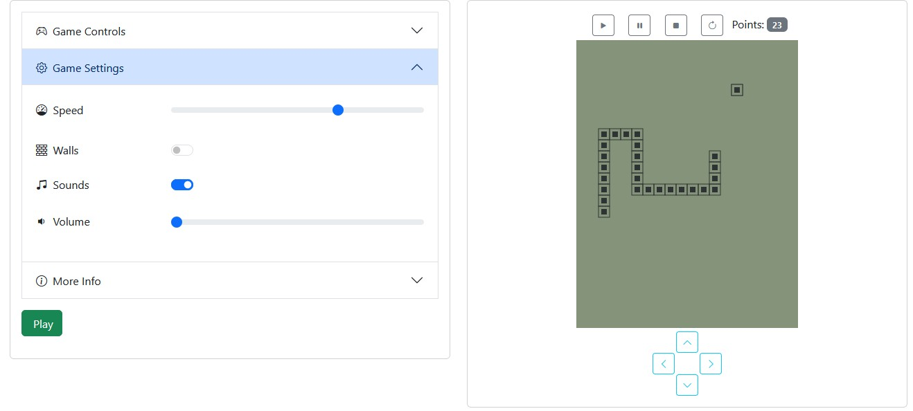

# IPA Snake Game
My adaptation of snake game on javascript. The game was created as part of learning the javascript language  



## Table of content
- [Install](#install)
- [Samples](#samples)
- [Usage](#usage)
- [Configuration](#configuration)
- [License](#license)

## Install
Download or install this repository to your project.

Install packages
```bash
npm install
```
 
## Samples
Samples for this game takes from site [rekkerd.org](https://rekkerd.org/mr-9999-brick-game-9999-in-1-samples/)

## Usage
Check **examples** folder with examples how to run a snake. Actions, settings, controls are optional. All what you need it's just add css and js to your page, and past code:

```html
<div data-ipa-snake-game="init"></div>
```

## Configuration
Check **examples** folder. 

_**Manual for configuration coming soon!**_

## License

The IPA Snake game is licensed under the [GPL-3.0](/LICENSE).